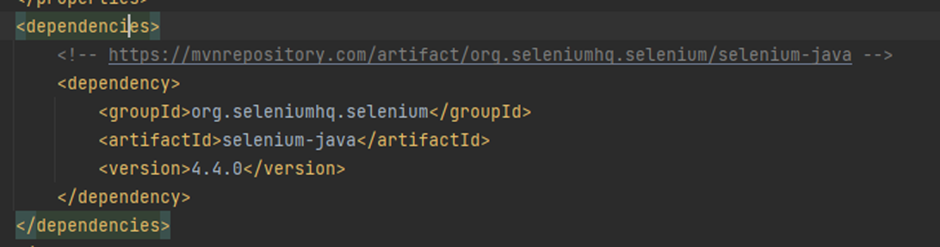
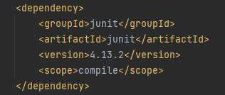
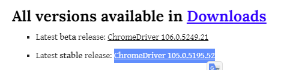
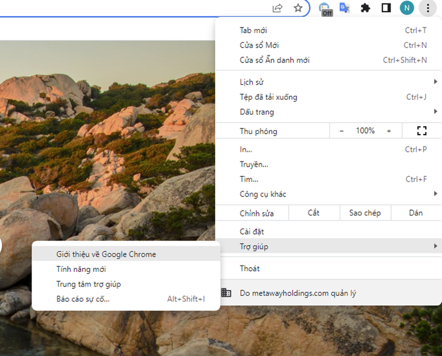

# Selenium Automation Test

## 1. Cài đặt Selenium
 - Tạo một Maven project Java bằng IntelliJ, add thư viện Selenium version 4.4.0 vào file pom.xml, [link](https://mvnrepository.com/artifact/org.seleniumhq.selenium/selenium-java/4.4.0)
   
 - Add thư viện Junit để tạo các test unit [link](https://mvnrepository.com/artifact/junit/junit/4.13.2)
   
 - Download Chrome Driver [tại đây](https://sites.google.com/chromium.org/driver/)

 - Nhớ down đúng phiên bản ứng với Chrome trên máy. Check version Chrome ở đây

## 2. 